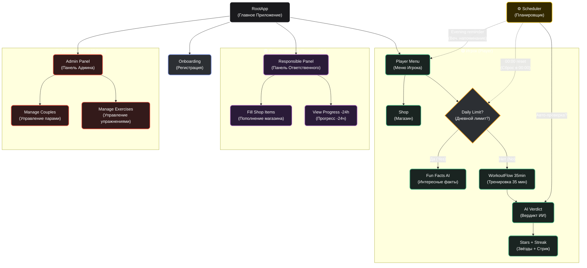

# Глобальная Архитектура Проекта (Bird's Eye View)

Эта схема показывает высокоуровневую навигацию между различными модулями (экранами) приложения.

```mermaid
graph TD
    %% Base Styles
    classDef root fill:#1A1A1D,stroke:#FFFFFF,stroke-width:2px,color:#FFFFFF,rx:8px,ry:8px;
    classDef player fill:#1A2421,stroke:#43B581,stroke-width:2px,color:#FFFFFF,rx:8px,ry:8px;
    classDef responsible fill:#2A1B38,stroke:#9B59B6,stroke-width:2px,color:#FFFFFF,rx:8px,ry:8px;
    classDef admin fill:#331A1A,stroke:#E74C3C,stroke-width:2px,color:#FFFFFF,rx:8px,ry:8px;
    classDef system fill:#332900,stroke:#F1C40F,stroke-width:2px,color:#FFFFFF,rx:8px,ry:8px;
    classDef decision fill:#2C2F33,stroke:#F39C12,stroke-width:2px,color:#FFFFFF;
    classDef default fill:#2C2F33,stroke:#7289DA,stroke-width:2px,color:#FFFFFF,rx:8px,ry:8px;
    
    %% Nodes
    Root["RootApp<br>(Главное Приложение)"]:::root
    Onboarding["Onboarding<br>(Регистрация)"]:::default
    
    %% Player Flow
    subgraph Player["🟢 Игрок (Player)"]
        PlayerMenu["Player Menu<br>(Меню Игрока)"]:::player
        Shop["Shop<br>(Магазин)"]:::player
        DailyLimit{"Daily Limit?<br>(Дневной лимит?)"}:::decision
        FunFacts["Fun Facts AI<br>(Интересные факты)"]:::player
        WorkoutFlow["WorkoutFlow 35min<br>(Тренировка 35 мин)"]:::player
        AIVerdict["AI Verdict<br>(Вердикт ИИ)"]:::player
        StarsStreak["Stars + Streak<br>(Звёзды + Стрик)"]:::player
    end

    %% Responsible Flow
    subgraph Responsible["🟣 Ответственный (Responsible)"]
        ResponsiblePanel["Responsible Panel<br>(Панель Ответственного)"]:::responsible
        FillShop["Fill Shop Items<br>(Пополнение магазина)"]:::responsible
        ViewProgress["View Progress -24h<br>(Прогресс -24ч)"]:::responsible
    end

    %% Admin Flow
    subgraph Admin["🔴 Администратор (Admin)"]
        AdminPanel["Admin Panel<br>(Панель Админа)"]:::admin
        ManageCouples["Manage Couples<br>(Управление парами)"]:::admin
        ManageExercises["Manage Exercises<br>(Управление упражнениями)"]:::admin
    end

    %% System Elements
    Scheduler["⚙️ Scheduler<br>(Планировщик)"]:::system

    %% Connections
    Root --> Onboarding
    Root --> PlayerMenu
    Root --> ResponsiblePanel
    Root --> AdminPanel

    %% Player Connections
    PlayerMenu --> DailyLimit
    PlayerMenu --> Shop
    DailyLimit -- "Нет (No)" --> WorkoutFlow
    DailyLimit -- "Да (Yes)" --> FunFacts
    WorkoutFlow --> AIVerdict
    AIVerdict --> StarsStreak

    %% Responsible Connections
    ResponsiblePanel --> FillShop
    ResponsiblePanel --> ViewProgress

    %% Admin Connections
    AdminPanel --> ManageCouples
    AdminPanel --> ManageExercises

    %% Scheduler Connections
    Scheduler -. "00:00 reset<br>(Сброс в 00:00)" .-> DailyLimit
    Scheduler -. "Evening reminder<br>(Веч. напоминание)" .-> PlayerMenu
    Scheduler -->|Авто-проверка?| AIVerdict
```
